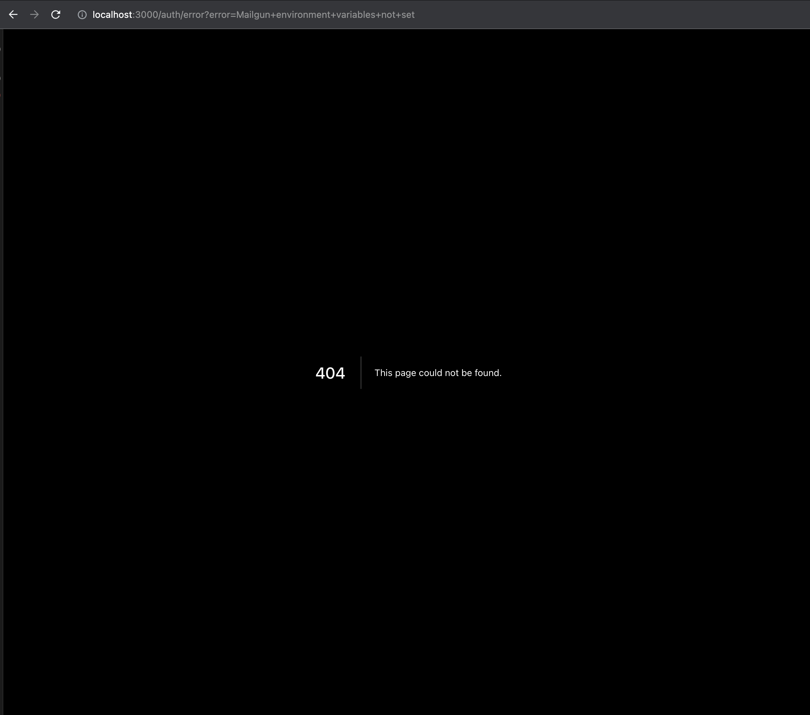

# Common erros

## Failed to execute command ... pnpm install

<figure><figcaption><p>Pnpm not found error</p></figcaption></figure>

Install pnpm from [https://formulae.brew.sh/formula/pnpm](https://formulae.brew.sh/formula/pnpm) or [https://pnpm.io/installation](https://pnpm.io/installation).

## Failed to execute command edgedb project init

<figure><figcaption><p>EdgeDB is not installed</p></figcaption></figure>

Install EdgeDB to your app by running `npx edgedb` or  by [https://www.edgedb.com/install](https://www.edgedb.com/install).&#x20;


## ERR\_PNPM\_BAD\_PM\_VERSION  This project is configured to use v8.9.0 of pnpm. Your current pnpm is

<figure><figcaption><p>error pnpm version mismatch</p></figcaption></figure>

Use this command to start your app `export COREPACK_ENABLE_STRICT=0 && pnpm dev`

## LogIn is not working?

<div align="left">

<figure><figcaption><p>Mailgun variables not set</p></figcaption></figure>

</div>

If you see this error then Mailgun variables not set in your .env, please check this guide [#obtain-mailgun-api-keys](setting-up-email-notifications.md#obtain-mailgun-api-keys "mention")

## Subscribing to Newsletter does not work

<div align="left">

<figure><figcaption><p>Newsletter subscription is not working</p></figcaption></figure>

</div>

This error is same as [#login-is-not-working](common-erros.md#login-is-not-working "mention") i.e. Mailgun variables are not set in .env

## Blank screen after local setup

<div align="left">

<figure><figcaption><p>Blank screen after login</p></figcaption></figure>

</div>

This is caused due to the config.json filter being empty. You can copy paste the default config from here :point\_down:

<details>

<summary>Default JSON</summary>

```json
{
  "HERO": {
    "cards": {
      "aboutCard": {
        "name": "Naman Parashar",
        "description": "Passionate about designing & coding great user experiences on the web.",
        "designation": "Prodcut Developer",
        "socialLinks": { "github": "https://github.com/nparashar150", "twitter": "https://twitter.com/nparashar150", "linkedIn": "https://www.linkedin.com/in/nparashar150" }
      },
      "tweetCard": { "name": "ShadcnUI", "tweet": "This landing page is awesome! #TheStartupTemplate", "username": "@shadcn", "avatarUrl": "https://github.com/shadcn.png" },
      "pricingCard": {
        "features": [
          { "icon": "keyRound", "title": "Pre-built Authentication" },
          { "icon": "atSign", "title": "Email Notifications" },
          { "icon": "code2", "title": "Pre-built Components" },
          { "icon": "databaseZap", "title": "Plug-and-Play Database" },
          { "icon": "settings2Icon", "title": "Live Playground" }
        ],
        "planName": "Free",
        "curlyText": "get started",
        "badgeTitle": "Most Popular",
        "description": "All the tools you need to launch fast and efficiently.",
        "pricePerMonth": "$0",
        "primaryButtonText": "Read the Docs"
      },
      "serviceCard": { "title": "Theme Switcher", "description": "Give your users the choice to switch between themes effortlessly, enhancing the experience." }
    },
    "title": "{{Simplify}}  your side {{hustle}}  journey",
    "pretitle": "Introducing The Startup Template",
    "subtitle": "Everything you need to build, launch, and grow your web app effortlessly. Focus on your vision, and start making your first $ faster.",
    "curlyText": "try now",
    "primaryButtonText": "npx create-thestartuptemplate@latest",
    "secondaryButtonText": "Playground"
  },
  "ABOUT": {
    "stats": [
      { "count": 290, "title": "Downloads" },
      { "count": 10, "title": "Users" },
      { "count": 2, "title": "Stars" },
      { "count": 1, "title": "Products" }
    ],
    "title": "About The Startup Template",
    "subtitle": "This is a pre-built template using Next.js, EdgeDB, Turborepo, Next Auth, ShadcnUI and Mailgun to help you quickly set up and launch your app. It includes a beautiful landing page, a dashboard, and essential integrations, saving you time and effort.",
    "aboutImage": "/pilot.png"
  },
  "BANNER": {
    "title": "Accelerate your project, launch faster, and succeed",
    "subtitle": "Effortlessly integrate auth, db, and email communication. Spend more time building your product, less on integrations. Get the tools you need to launch quickly with ease.",
    "primaryButtonText": "Playground",
    "secondaryButtonText": "Docs"
  },
  "FOOTER": {
    "brand": [{ "href": "/", "icon": "logo", "label": "'The Startup'", "target": "_self" }],
    "Resources": [
      { "href": "https://docs.side.quik.run", "label": "Docs", "target": "_blank" },
      { "href": "#faq", "label": "Frequency Asked Questions", "target": "_self" }
    ],
    "Connect with me": [
      { "href": "mailto:nparashar150@gmail.com", "label": "Email: nparashar150@gmail.com", "target": "_self" },
      { "href": "https://github.com/nparashar150", "label": "GitHub: nparashar150", "target": "_blank" },
      { "href": "https://twitter.com/nparashar150", "label": "Twitter: @nparashar150", "target": "_blank" }
    ]
  },
  "NAVBAR": {
    "leftLinks": [{ "href": "/", "icon": "logo", "label": "'The Startup'", "target": "_self" }],
    "rightLinks": [{ "href": "https://github.com/nparashar150/thestartuptemplate", "icon": "gitHub", "label": "Github", "target": "_blank" }],
    "centerLinks": [
      { "href": "/dashboard", "label": "Playground", "target": "_self" },
      { "href": "https://docs.side.quik.run", "label": "Docs", "target": "_blank" },
      { "href": "/#faq", "label": "FAQ", "target": "_self" },
      { "href": "https://github.com/nparashar150/thestartuptemplate/blob/main/CONTRIBUTING.md", "label": "Contribute", "target": "_blank" }
    ]
  },
  "PARTNERS": {
    "title": "Tools and Technologies",
    "partners": [
      { "name": "Next.js", "logoUrl": "/next-js.svg" },
      { "name": "EdgeDB", "logoUrl": "/edb.png" },
      { "name": "Turborepo", "logoUrl": "/turborepo.png" },
      { "name": "Next Auth", "logoUrl": "/next-auth.png" },
      { "name": "ShadcnUI", "logoUrl": "/shadcn.png" },
      { "name": "Mailgun", "logoUrl": "/mailgun.svg" }
    ],
    "subtitle": "List of tools and technologies used in The Startup Template"
  },
  "FEATURE_CARDS": {
    "tags": [],
    "title": "Accelerate your development and engagement",
    "features": [
      { "icon": "keyRound", "title": "Authentication", "description": "Simplify development by integrating authentication effortlessly." },
      { "icon": "atSign", "title": "Email Notifications", "description": "Enhance user engagement with automated email alerts for important events." },
      { "icon": "databaseZap", "title": "Data Management", "description": "Efficiently manage and store user data with EdgeDB." },
      { "icon": "code2", "title": "Playground", "description": "Experiment with the template and create your custom configurations with ease." }
    ],
    "subtitle": "Seamlessly integrate authentication, notifications, data management, and SEO optimization"
  },
  "NEWSLETTER_CONFIG": {
    "title": "Join my newsletter",
    "subtitle": "Get occasional updates, tips, and tricks (I promise not to spam you, I'm too lazy for that)",
    "curlyText": "subscribe now",
    "buttonText": "Subscribe",
    "inputPlaceholder": "pro.dev@gmail.com"
  },
  "FREQUENTLY_ASKED_QUESTIONS": {
    "items": [
      {
        "key": "item-1",
        "answer": "The Startup Template is a template built using EdgeDB, Next.js, ShadcnUI, and NextAuth to help you quickly set up and launch your web app. It includes a beautiful landing page, a dashboard, and essential integrations, saving you time and effort. It significantly reduces development time and effort, allowing you to focus on what truly matters.",
        "question": "What is The Startup Template?"
      },
      { "key": "item-4", "answer": "Comprehensive documentation is available at https://docs.side.quik.run. It includes guides on getting started, customization options, and more.", "question": "Where can I find the documentation?" },
      {
        "key": "item-5",
        "answer": "Yes, you can use The Startup Template for both personal and commercial projects. It's designed to help you launch your web app quickly, whether it's a hobby project or a business venture. Provided you mention the original authors.",
        "question": "Can I use The Startup Template for commercial projects?"
      },
      {
        "key": "item-3",
        "answer": "If you find this project helpful, please consider supporting our work by donating https://github.com/sponsors/nparashar150. Your support helps us continue to improve and maintain the template.",
        "question": "How can I support the development of The Startup Template?"
      },
      {
        "key": "item-2",
        "answer": "If you have any questions or need assistance, feel free to reach out to me at nparashar150@gmail.com. We're here to help you get the most out of The Startup Template.",
        "question": "Do you offer support if I run into issues?"
      }
    ],
    "title": "Frequently Asked Questions",
    "subtitle": "Find answers to common questions about The Startup Template",
    "contactEmail": "nparashar150@gmail.com"
  }
}
```

</details>
