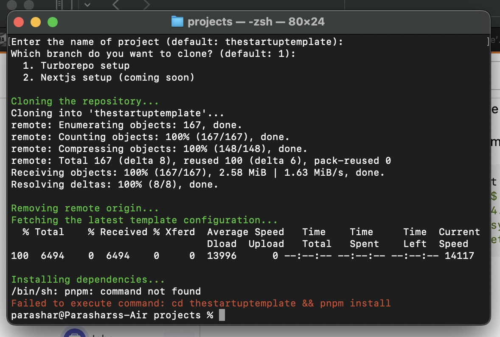

# Enabling Authentication

## **Enable Google Login**

1.  **Create Credentials on Google Cloud Console**:

    * Go to [Google Cloud Console](https://console.cloud.google.com/).
    * Create a new project or select an existing one.
    * Navigate to "APIs & Services" > "OAuth consent screen".
    * Configure the consent screen for your project.
    * Go to "Credentials" > "Create Credentials" > "OAuth 2.0 Client IDs".
    * Fill in the required details and create the credentials.
    * Obtain your `GOOGLE_CLIENT_ID` and `GOOGLE_CLIENT_SECRET`.

    <figure><figcaption></figcaption></figure>
2.  **Add to .env File**:

    * Open your `.env` file and add the following:

    ```env
    GOOGLE_CLIENT_ID=your_google_client_id
    GOOGLE_CLIENT_SECRET=your_google_client_secret
    ```

## &#x20;**Enable GitHub Login**

1. **Create a GitHub Application**:
   * Go to [GitHub Developer Settings](https://github.com/settings/developers).
   * Click on "New OAuth App".
   *   Fill in the required details and register your application.\


       <figure><figcaption></figcaption></figure>
   *   Obtain your `GITHUB_ID` and `GITHUB_SECRET`.\


       <figure><figcaption></figcaption></figure>
2.  **Add to .env File**:

    * Open your `.env` file and add the following:

    ```env
    GITHUB_ID=your_github_client_id
    GITHUB_SECRET=your_github_client_secret
    ```

## Example .env File

Here is an example of what your `.env` file should look like after adding both Google and GitHub credentials:

```env
GOOGLE_CLIENT_ID=your_google_client_id
GOOGLE_CLIENT_SECRET=your_google_client_secret
GITHUB_ID=your_github_client_id
GITHUB_SECRET=your_github_client_secret
```

**Test Authentication**: Open [http://localhost:3000](http://localhost:3000) in your browser and test the Google and GitHub login functionalities.

## Additional Resources

* [NextAuth.js Documentation](https://next-auth.js.org/getting-started/introduction)

***

## Need Help?

If you have any feedback or run into any issues, don't hesitate to reach out at [nparashar150@gmail.com](mailto:nparashar150@gmail.com).&#x20;

Happy coding!
